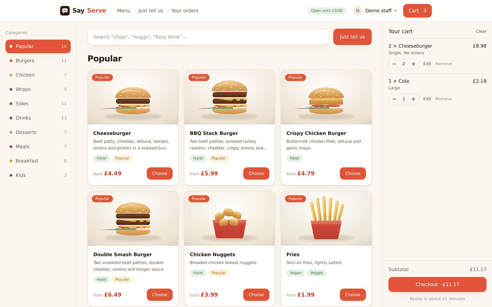
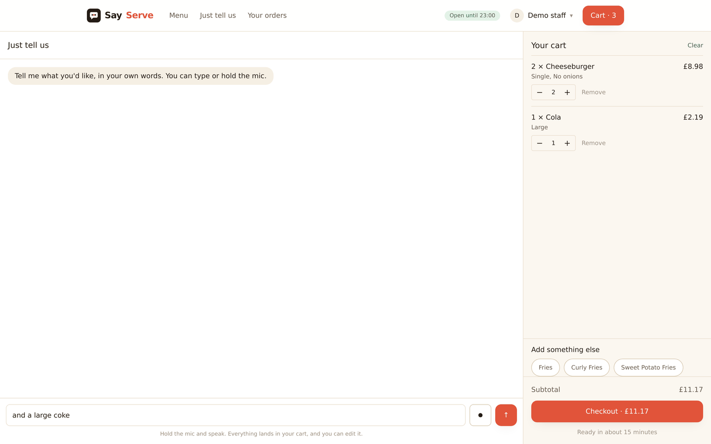
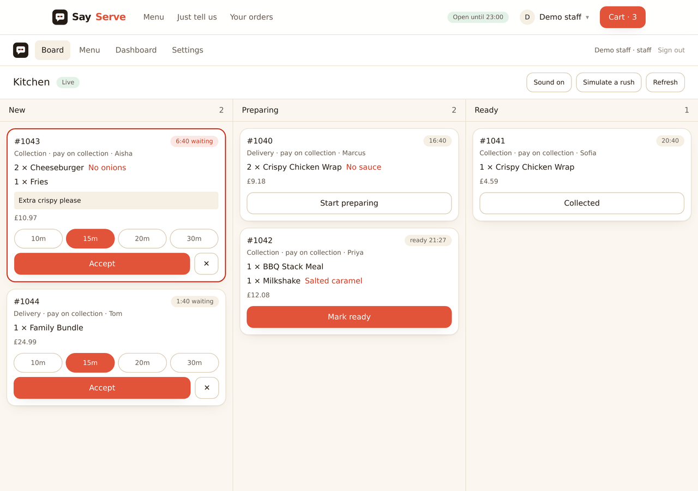
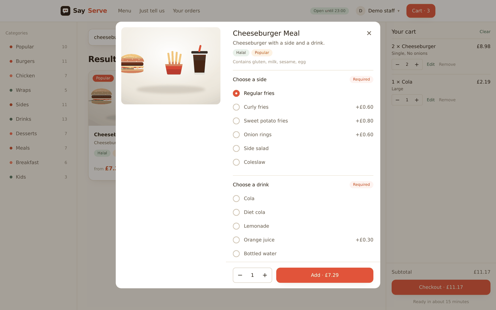
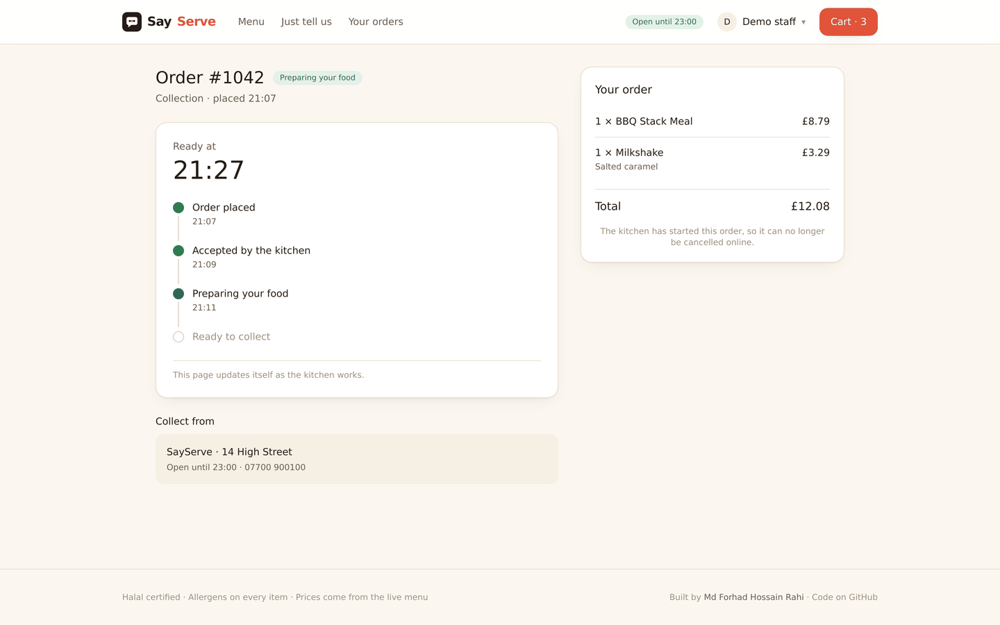
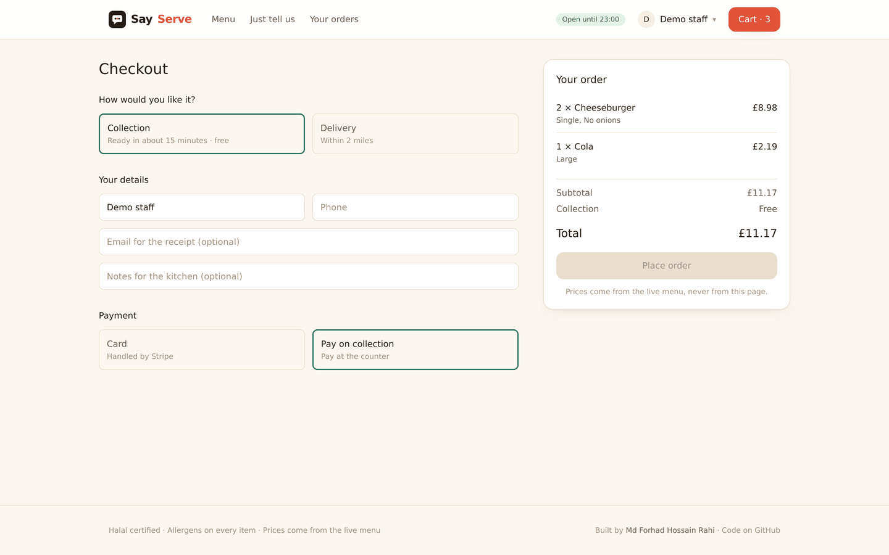
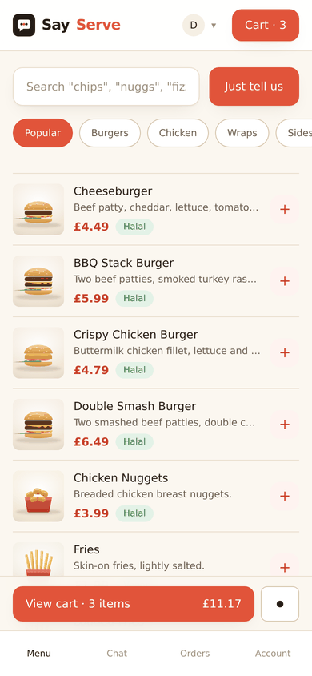

<!-- Update the two links below if your deployed URLs differ. -->
[](https://github.com/MdRahi99/sayserve/actions/workflows/ci.yml)

# SayServe

**Say it. We serve it.** A takeaway ordering system where tapping, typing and speaking all fill the same cart — and where the server decides everything that involves money.

> Most orders never reach a language model. The ones that do cannot invent an item or a price.

**[Live site](https://sayserve.vercel.app)** · [Plan and architecture](docs/PLAN.md) · [Deploying](docs/DEPLOY.md) · [Testing walkthrough](docs/TESTING.md) · [Wireframes](docs/wireframes/)

> Two buttons on the home page put you straight in as a customer or behind the counter, with orders already on the kitchen board. No sign-up. The API sleeps on the free tier, so the first load can take half a minute.



---

## Screenshots

| The assistant | The kitchen board |
| --- | --- |
|  |  |
| **Customising an item** | **Order tracking** |
|  |  |
| **Checkout** | **On a phone** |
|  |  |

The dashboard and the landing page are in [docs/screenshots](docs/screenshots).

---

## What it does

**For customers.** Browse a 70-item menu by category, or search it in plain words — "chips" finds Fries. Customise anything: size, add-ons, take the onions off, with the price updating as you go. Or skip all of that and type "two cheeseburgers, no onions, and a large coke", or hold the mic and say it. Check out for collection or delivery, pay by card or at the counter, then watch the order move as the kitchen works on it. No account needed; one is only there to keep your history.

**For the kitchen.** A live board on a tablet: new orders arrive with a sound, timers turn amber then red, accept with a ready time or reject with a reason. Staff can mark an item sold out or close the shop mid-shift.

**For the owner.** Menu and prices, delivery settings, and a dashboard showing sales, busy hours, top items, average prep time, and what the assistant is costing.

---

## Where this is up to

| Phase | What | Status |
| --- | --- | --- |
| 0 | Plan, menu data, wireframes | Done |
| 1 | Auth and roles, menu API, pricing engine, order state machine, idempotent checkout | Done |
| 2 | Customer web: menu, customiser, cart, checkout, tracking, history | Done |
| 3 | Admin: live kitchen board, menu manager, settings, dashboard | Done |
| 4 | The assistant: safety gate, parser, menu matching, chat, voice, eval harness | Done |
| 5 | Payments, demo mode, accessibility, end-to-end test | Done |
| 6 | Deploy, README, screenshots, case study | Done |

---

## The four ideas worth reading the code for

**1. One rule sets every price.**

```
unitPrice = basePrice + sum(priceDelta of every chosen option)
lineTotal = unitPrice × quantity
```

Customers and the assistant may only say *which* options were chosen. Every number comes from the menu document. A client that sends its own `unitPrice` is ignored, and there is a test that proves it.

Option groups carry `min` and `max`, which is also how "incomplete" is decided. A meal needing exactly one drink is data, not an opinion, so an unfinished order comes back as `missing_choice` naming the group — which is what lets the UI ask one specific question with buttons instead of "could you clarify?".

See [`src/lib/pricing.ts`](apps/api/src/lib/pricing.ts).

**2. One table defines every legal status move.**

Nothing else in the codebase assigns `order.status`. A route asks `canTransition` first, and anything unlisted is a `409`. Each move also records who may make it, so "customer cancels" and "staff rejects" are different transitions even though both end an order. A customer can cancel before the kitchen accepts and not after — in the API, not just in the button.

See [`src/lib/orderState.ts`](apps/api/src/lib/orderState.ts).

**3. The browser never holds a price.**

The cart in `localStorage` stores *which* item and *which* options, and nothing about money. Every figure on screen comes back from `POST /api/orders/quote`. A tampered cart changes which items get quoted and nothing else, and a stale price cannot be displayed because there is no price to go stale.

The same rule makes the UI honest about incomplete orders: a meal with no drink chosen sits in the cart flagged and unpriced, and the Checkout button is disabled because the server said `complete: false` — not because the client worked it out.

See [`apps/web/src/lib/cart.ts`](apps/web/src/lib/cart.ts) and [`CartPanel.tsx`](apps/web/src/components/CartPanel.tsx).

**4. One idempotency key per visit to checkout, not per click.**

If the connection drops after the server created the order but before the reply arrives, pressing Pay again sends the same key and the API returns the order it already made. A fresh key per click would create a duplicate — which is the bug the key exists to prevent, so generating it in the click handler would quietly defeat it.

See [`CheckoutForm.tsx`](apps/web/src/components/CheckoutForm.tsx).

---

## The assistant

Five stages. The model is the fourth, and most messages never reach it.

```
message
  1. safety    deterministic regex. the only stage that may refuse
  2. parse     "2 cheeseburgers, no onions, and a large coke" — no model call
  3. resolve   exact, then typo-tolerant, then meaning: "chips", "something fizzy"
  4. model     only the messy ones. returns the whole cart as JSON
  5. apply     priced and validated against the live menu
```

"Two cheeseburgers and a large coke" is not a language problem. It is a quantity, an item and a size, in a sentence people have used at counters for decades. Reading it directly takes about ten milliseconds and costs nothing. The model is the fallback for the messy ones, and even then it only *proposes* a cart: the server prices it, checks it against the live menu, and owns the order.

Stage 5 decides what is missing by looking at the actual cart rather than guessing from wording. Whether a meal is missing its drink is not an opinion to be inferred from a sentence — it is a fact the option-group data already knows.

Everything before the model is local and offline, so the site keeps taking orders when the provider is down or unconfigured — and so the eval can run in CI with no keys.

### What it scores

29 hand-written cases, run through the real pipeline on every push:

```
Exact cart match             29/29  100%
Route as expected            29/29
Finished without the model   29/29  100%
Slowest case                 11 ms
```

Two things about that set. It is written by hand and never generated: a test set produced by the same kind of model the system uses measures agreement, not correctness. And it scores the resulting **cart**, not the wording, so the reply is free to change and the order is not.

It also carries a must-not-refuse list — "is anything half price today?", "can I collect at 1800", "I'll pay cash". Naive safety rules refuse all three. An attack that gets through is a bug; a customer who gets refused is a lost order.

### In the browser

The assistant writes into the same cart the menu writes into, and the cart sits beside the conversation so you watch it fill. Anything it adds can still be edited by hand. Each reply carries a small grey line saying which route the message took — "Matched directly · 11 ms · no model call" — because an assistant that admits when it did not need a model is easier to trust than one that never explains itself.

Voice uses the browser's own Web Speech API: no audio upload, no transcription bill, no latency past the local recogniser. The trade is support — Chrome, Edge and Safari have it, Firefox does not — so the mic button only appears where it works. Speech lands in the input box rather than sending straight away, so a misheard word gets corrected instead of ordered.

### Two keys, both optional

`GROQ_API_KEY` adds conversation. `VOYAGE_API_KEY` adds meaning-matching, by embedding each item's name, aliases and description once at startup. Without either, ordering still works.

---

## Real-time

Socket.io, with rooms rather than broadcasts. Staff join `kitchen` on connect and see every order. A customer joins only the room for an order they can prove is theirs — by owning it, or by holding the guest token from checkout. Without that check, anyone could listen to the whole shop by guessing an id.

Routes never import the socket server. They call `emitOrderNew` in [`lib/events.ts`](apps/api/src/lib/events.ts), which does nothing at all when no socket is attached — which is exactly how the tests run.

---

## Payments

Stripe Checkout in test mode, and optional: with no key the card option is hidden and the shop takes payment on collection, which is how most takeaways started and a better failure than a checkout that throws.

Two things make the webhook safe. The signature is verified, so only Stripe can reach it — without that, anyone who knows the URL could mark orders paid. And it moves the order through the same state machine as everything else, as the "system" actor, so a webhook cannot push an order somewhere a human could not.

A card order exists before it is paid, as `pending_payment`, and the kitchen cannot see it. It becomes a real order when the payment lands, or expires by itself after thirty minutes. Line items are built from the order's own frozen lines, so what Stripe charges and what the kitchen cooks come from the same row.

Rejecting or cancelling a paid order refunds it automatically. If the refund call fails, the status change still stands and the failure is logged: a refund needing a human beats an order stuck in the kitchen.

---

## Seeing it work in thirty seconds

Two buttons on the home page: try as a customer, or try as staff. Each makes a throwaway account that deletes itself after a day.

The staff one fills the kitchen board on the way in. A board with nothing on it demonstrates nothing, so **Simulate a rush** makes five plausible orders — staggered start times so the age timers differ, a few with modifiers so the red "no onions" line shows, a mix of collection and delivery. Everything it makes is flagged `isDemo` and expires, so the dashboard can tell real numbers from theatre.

---

## Two roles, not one

Staff can mark an item sold out and open or close the shop — things that happen mid-shift, where waiting for the owner would be absurd. Prices, new items, deletions and delivery settings are the owner's: a wrong price is a wrong receipt, and there is no undo on money.

The split lives in the API, not in the UI. Hiding a button is a courtesy; `requireRole("admin")` is the rule.

---

## Guests are first-class

There is no sign-up wall. Checkout takes a name and a phone number, and the API hands back a token that the browser keeps, so a guest can watch their order and cancel it without an account. Signing in only adds history across devices.

Tracking rides the same socket the kitchen board uses, so the timeline moves the moment the kitchen taps Accept. Polling stays as a slow safety net for a dropped connection or a proxy that will not hold a websocket open, and both stop once the order is finished.

---

## Menu data

70 items across nine categories, 24 shared option groups, 201 aliases including UK slang ("chips", "nuggs", "cuppa", "dirty fries"). Allergens and dietary tags on every item; breakfast carries a serving window.

Option groups are defined once and referenced by id, so "Choose a drink" is edited in one place and every meal updates. The seed script re-checks integrity before writing: duplicate ids, broken `linkedItem` references, impossible `min`/`max`, more than one default per group.

One ambiguity is deliberate: "brew" maps to both Coffee and Tea. It stays as a permanent test that the assistant asks rather than guesses.

Every item has an illustration, drawn by [`tools/gen-menu-art.py`](tools/gen-menu-art.py) from shared parts — one burger function with arguments for cheese, a second patty, a chicken fillet, jalapeños. Seventy files, about 550 KB in total, less than one photograph, and consistent by construction. Swapping in real photographs means pointing `imageUrl` at them; nothing else changes.

---

## API

| Method | Route | Who |
| --- | --- | --- |
| POST | `/api/auth/register` · `/login` · `/logout` · `/demo` | Anyone |
| GET · PATCH | `/api/auth/me` | Signed in |
| GET | `/api/menu` · `/api/menu/categories` · `/api/menu/:slug` | Public |
| POST | `/api/orders/quote` | Anyone |
| POST | `/api/orders` | Anyone (guest or signed in) |
| GET | `/api/orders/mine` · `/api/orders/:id` | Owner, guest with token, or staff |
| POST | `/api/orders/:id/cancel` | Owner or guest with token |
| GET | `/api/orders/kitchen/board` | Staff, admin |
| POST | `/api/orders/:id/status` | Staff, admin |
| POST | `/api/chat` | Anyone |
| GET · POST · PATCH · DELETE | `/api/admin/menu…` · `/api/admin/settings` · `/api/admin/stats` · `/api/admin/assistant` | Staff or admin |
| POST | `/api/stripe/webhook` | Stripe only, signature checked |

Auth is a JWT in an httpOnly cookie. Guests get a token at checkout so they can watch their order without an account.

---

## Deploying it

Vercel for the web app, Render for the API, MongoDB Atlas for the database, all on free tiers. The API cannot go on Vercel: the kitchen board holds a websocket open, and Vercel's free tier runs short-lived functions.

Step by step, including the Stripe webhook and the mistakes that cost an hour, in [docs/DEPLOY.md](docs/DEPLOY.md).

Two settings do most of the damage if you get them wrong: `CORS_ORIGIN` must match the deployed web URL exactly, and the API's build command needs `npm ci --include=dev`, because `NODE_ENV=production` otherwise strips the TypeScript types the build depends on.

---

## Running it locally

You need Node 20+ and a MongoDB connection string (a free Atlas M0 cluster works).

```bash
git clone https://github.com/MdRahi99/sayserve.git
cd sayserve
npm install

cp apps/api/.env.example apps/api/.env   # fill in MONGODB_URI and JWT_SECRET
cp apps/web/.env.example apps/web/.env.local
npm run seed                             # loads 70 items and 24 option groups

npm run dev:api                          # http://localhost:5000
npm run dev:web                          # http://localhost:3000  (second terminal)
```

Generate a secret with:

```bash
node -e "console.log(require('crypto').randomBytes(48).toString('base64url'))"
```

Check it is alive:

```bash
curl http://localhost:5000/api/health
curl -X POST http://localhost:5000/api/orders/quote \
  -H 'Content-Type: application/json' \
  -d '{"lines":[{"slug":"cheeseburger-meal","quantity":1}]}'
```

That second call comes back incomplete, naming the drink group. Add `"choices":{"meal-drink":["Cola"]}` and it prices.

---

## Tests

```bash
npm run test:unit   # pricing and the state machine — pure, instant
npm run test:eval   # the assistant, 29 cases, no keys needed
npm test            # everything, including the full order lifecycle over HTTP
npm run test:e2e    # one order, the whole way through, in a real browser
```

The integration suite places a real order and drives it to Completed, then proves the closed paths are closed: skipping a step, rejecting without a reason, a customer accepting their own order, cancelling after the kitchen started, a double-tapped Pay button, and one customer reading another's order.

CI runs the typecheck, the unit tests, the assistant eval and the integration suite on every push, against a MongoDB service container.

The end-to-end tests are not in CI. They need two servers, a database and a browser; a flaky end-to-end job teaches everyone to ignore red builds, which costs more than it catches. They run before a deploy. See [e2e/README.md](e2e/README.md).

---

## Stack

TypeScript everywhere. Node, Express, Mongoose, Zod, JWT and Socket.io on the API. Next.js and Tailwind on the web app. One hosted LLM and one hosted embedding model, both optional. Stripe in test mode. Vitest and Supertest for tests, Playwright for end to end, GitHub Actions for CI.

No Python and no trained model. The embeddings come from an API, so there is nothing to train and nothing to host; a folder of machine learning that did no work would be decoration. If logged traffic later justifies a trained fast-path model, it comes back then, with real data behind it.

---

## Built by

[FH Rahi](https://mdrahi.vercel.app) · [GitHub](https://github.com/MdRahi99)

## Licence

MIT
