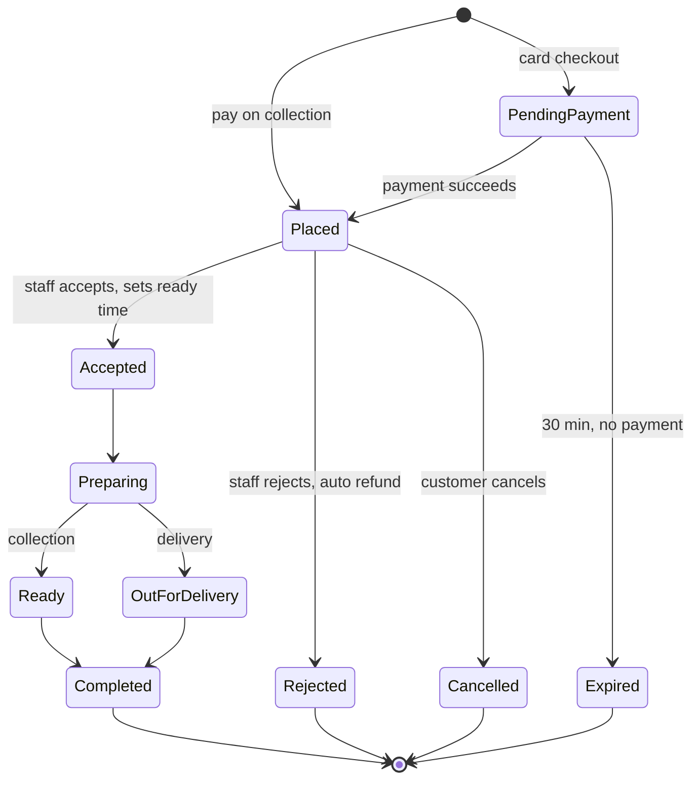
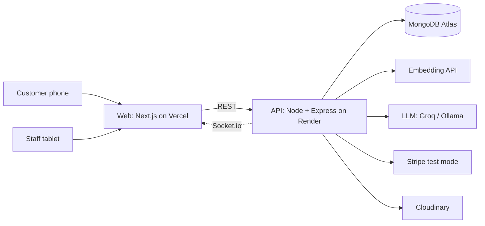

# SayServe: project plan (v2)

> **Say it. We serve it.**
> A takeaway ordering system where tapping, typing and speaking all fill the same cart, and the server decides everything that involves money.

Status: Phase 0 (in progress) · Last updated: 12 September 2026

---

## 0. What changed from v1, and why

My first plan was fronter with a bigger UI bolted on. That was the wrong instinct. Here is the honest audit.

### Keep (3 things, and only 3)

| Idea | Why it survives |
| --- | --- |
| Only deterministic rules may refuse a request | A probabilistic model should never be a security gate. This is genuinely good design and is worth keeping. |
| The database owns every price | The single most important rule in any ordering system. |
| Validate last, against live data | An AI suggestion is a request, not a fact. |

### Drop

| Dropped | Why |
| --- | --- |
| TF-IDF + Random Forest intent classifier as the centrepiece | It answered the wrong question. Guessing from wording whether an order is "incomplete" is worse than looking at the actual cart and seeing that a required choice is missing. Better embeddings would not fix a badly chosen task. |
| The separate Python service | It exists only to run that classifier. It costs a whole extra deployment, a cold start and a network hop on every order. |
| The 210-order dataset and its 6 labels | Built for a one-shot benchmark, not a conversation. Starting clean. |
| The flat menu model (loose `sizes` / `addons` / `components`) | It cannot express "pick a drink" or "choose 2 sauces", which is most of what a real customer says. The pricing bug I found in fronter is a symptom of this. |
| One-shot ordering | Real ordering is a conversation, and a cart that gets edited. |
| The generic "Could you clarify?" reply | A dead end. The system knows exactly what is missing; it should ask that. |

### The new core idea

> **The AI proposes a cart diff. The server prices it, validates it and owns it.**

The AI never writes an order, never sets a price and never talks to the database. It returns a list of proposed changes (`add`, `remove`, `set_quantity`, `set_option`). The server applies what is legal and rejects the rest. That is the modern agent pattern, and it is a better thing to show an employer than a 51% classifier.

### Is there still machine learning in it?

Yes, but ML that earns its place:

1. **Semantic menu resolution (embeddings).** "Chips", "fizzy drink", "something not spicy", "the veggie one" all have to reach the right menu item. This is retrieval, which is what embeddings are genuinely good at, and it is the part that delivers what I actually wanted from "understands synonyms".
2. **An evaluation harness.** A held-out set of realistic messages scored on whether the resulting cart is exactly right, run in CI so a prompt or model change cannot quietly make things worse.

Point 2 is what separates this from a weekend project. An accuracy number is only worth anything if a machine re-checks it on every commit.

**No Python, and no model training.** The embeddings come from an API, so there is nothing to train and nothing to host. Keeping a Python folder just to look like machine learning would be decoration. The whole repo is TypeScript, and the eval harness runs in Vitest beside the other tests. If logged traffic later justifies a trained fast-path model, Python comes back then, with real data behind it.

---

## 1. Scope

One restaurant. Collection and local delivery. GBP. Halal menu. Phone-first for customers, tablet-first for staff.

---

## 2. The ordering pipeline

Every customer message runs through the same five stages. Each one can finish the job, so the expensive stage usually never runs.

```
message
  │
  ├─ 1. Safety gate ─────────── deterministic. The ONLY stage that can refuse.
  │
  ├─ 2. Deterministic parse ─── "2 cheeseburgers and a large coke"
  │                              quantity + item + size, exact and alias matches.
  │                              Confident and complete? Apply it. NO LLM CALL.
  │
  ├─ 3. Hybrid resolve ──────── lexical match + embedding match over the menu.
  │                              One clear winner? Continue. Several close? Ask
  │                              with buttons ("Did you mean Fries or Curly Fries?").
  │
  ├─ 4. LLM ────────────────── only for the messy stuff: multiple items,
  │                              changes to an existing cart, questions,
  │                              "same as last time but no onions".
  │                              Returns a cart diff as strict JSON.
  │
  └─ 5. Apply and price ─────── server checks every line: item exists, is in stock,
                                 options are legal, required choices are made,
                                 quantity is within limits, price comes from the DB.
                                 Anything missing becomes a specific question.
```

**Why this beats fronter's pipeline.** Fronter sent every order to an LLM after a classifier guessed at it. Here, the classifier is replaced by an attempt: try to parse it properly, and if that works, you are done in about 20 ms for free. The LLM becomes the fallback rather than the engine, which makes the system faster, cheaper and more predictable. That is a real engineering argument, and it is measurable.

**Stage 5 is where "incomplete" is decided.** If someone says "a cheeseburger meal", the server knows the meal needs a drink choice and asks for it. No model has to guess. This is why the intent classifier is gone.

### Graceful degradation

| If this is down | What still works |
| --- | --- |
| The LLM provider | Stages 1 to 3. Simple orders and the whole tap-based menu. |
| The embedding API | Lexical matching and aliases. |
| Everything AI | The full menu, cart, checkout and kitchen. The site is not a chatbot with a menu attached. |

---

## 3. Semantic matching, concretely

Each menu item gets one text blob (name + aliases + description + tags) turned into a vector when it is saved. The customer's phrase is turned into a vector too, and the closest items win.

| Decision | Choice | Reason |
| --- | --- | --- |
| Where the vectors live | In the `menuItems` documents | For about 80 items, comparing in memory takes under a millisecond. MongoDB Atlas Vector Search is free even on M0 and I will note it in the README as the path for multi-restaurant, but for one menu it would be an extra moving part for no gain. Saying that honestly is worth more than using it for show. |
| Query-time embedding | A hosted embedding API, with an in-memory cache | The API key is free-tier, the call is about 30 ms, and there is no PyTorch and no 512 MB memory problem on the free host. |
| Fallback | Lexical: exact, alias, then fuzzy | So the system never fully depends on someone else's uptime. |
| Scoring | Hybrid: combine the lexical and vector scores | Catches both "coke" (exact) and "something fizzy" (meaning). |

Aliases stay in the admin UI on purpose: staff know their customers' words ("chips", "pop", "a large one"). Human knowledge and the model work together instead of competing.

---

## 4. Menu model (the part fronter got wrong)

The fix is **option groups**, the same shape every real ordering system uses.

```js
MenuItem {
  name, slug, description, imageUrl, category,
  basePrice,
  tags: ["halal", "vegetarian", "spicy"],
  allergens: ["gluten", "milk"],
  aliases: ["cheese burger", "cheeseburger"],
  embedding: [...],
  available, availableFrom, availableTo,   // breakfast items
  optionGroups: [
    {
      name: "Size",
      min: 1, max: 1,                      // exactly one required
      options: [
        { name: "Regular", priceDelta: 0 },
        { name: "Large", priceDelta: 0.80 }
      ]
    },
    {
      name: "Remove",
      min: 0, max: 5,                      // optional, many allowed
      options: [{ name: "No onions", priceDelta: 0 }]
    },
    {
      name: "Choose a drink",
      min: 1, max: 1,
      options: [{ name: "Cola", priceDelta: 0, linkedItem: "cola" }]
    }
  ]
}
```

**What this buys:**

- Pricing is one rule: `basePrice + sum(priceDelta) × quantity`. Fronter's "large fries charged as small" bug cannot exist.
- `min`/`max` define what "incomplete" means, in data rather than in a model's opinion.
- Meals are just items with a "choose a drink" group, so they need no special code.
- The same structure drives the customiser UI, the AI validation and the kitchen ticket.

**The menu is built.** `menu.json`: **70 items** across burgers (11), chicken (7), wraps (5), sides (11), drinks (13), desserts (7), meals (7), breakfast (6) and kids (3), plus **24 shared option groups** and **201 aliases** including UK slang ("chips", "nuggs", "cuppa", "dirty fries", "coke zero"). Allergens and dietary tags on every item. Breakfast items carry a time window.

Option groups are defined once and referenced by id, so "Choose a drink" is edited in one place and every meal updates. A build-time validator checks for duplicate ids, broken `linkedItem` references, impossible `min`/`max` and more than one default per group. It currently reports one deliberate ambiguity: "brew" maps to both Coffee and Tea, which is kept as a live test that the system asks instead of guessing.

---

## 5. Voice

Speech in the browser via the Web Speech API: hold a button, speak, the words appear in the chat box and run through the same pipeline. Text is always editable, so a misheard word is never stuck.

This is worth building because it makes the name honest, it is the actual use case for a counter or a drive-through, and it is memorable in a portfolio. It is also about 40 lines of code on top of a chat that already works, so it is cheap.

---

## 6. Order lifecycle



| Rule | Why |
| --- | --- |
| One state machine in the API defines every legal move. Anything else returns `409`. | No screen and no bug can skip a step. |
| Every move appends to `statusHistory` (from, to, who, when). | Audit trail, and it renders the customer's timeline for free. |
| Item names, options and prices are **copied** into the order at checkout. | Tomorrow's price rise never changes yesterday's receipt. |
| Customers can cancel only before `Accepted`. | The kitchen never cooks a cancelled order. |
| Checkout is idempotent (client-supplied key). | A double-tap or a retry cannot create two orders. |
| Paid orders that end in `Rejected` or `Cancelled` refund automatically. | Money follows status, always. |
| Every move is pushed over a socket to the customer and the kitchen board. | No refreshing. |

---

## 7. Architecture



**Two services, not three.** The AI logic is a module inside the API, next to the code that owns the cart. Fronter's third service existed to host one `.joblib` file; without that file there is nothing to host. Fewer cold starts, one less thing to explain, and no network hop in the middle of an order.

**Why the API is on Render, not Vercel.** The live kitchen board needs a socket held open, and Vercel's free tier runs short-lived functions. The trade-off is that Render's free tier sleeps after about 15 minutes idle, so the first visit is slow; the demo button wakes it. Putting the API on Vercel would mean polling every few seconds instead, which is weaker.

### Stack

| Part | Tools | Why |
| --- | --- | --- |
| Web | Next.js (App Router), TypeScript, Tailwind, shadcn/ui, TanStack Query, Zustand | Server-rendered menu pages are fast and findable. Different frontend skills from ReachIt's Vite SPA. |
| API | Node, Express, TypeScript, Mongoose, Zod, Socket.io, JWT in an httpOnly cookie | My strongest stack. Zod validates every request body and every LLM response. |
| LLM | Groq free tier, `openai/gpt-oss-20b` (pinned in an env var) | ~30 req/min, 1,000/day, no card. Same hosted provider locally and in production, so there is no deploy-day surprise. |
| Embeddings | Voyage `voyage-4-lite` | Cheap, large free allotment, and owned by MongoDB. The 70-item menu is embedded once at seed time. |
| Payments | Stripe Checkout, webhooks, refunds, test mode | Real flow, no real money. |
| Tests | Vitest + Supertest, Playwright, plus the AI eval harness | Each layer tested where it lives. |
| CI | GitHub Actions | Lint, types, tests and the AI eval on every push. |

---

## 8. How the AI is measured

The harness runs about 200 hand-written messages (never generated, so the score is honest) through the real pipeline against a test database, and compares the resulting cart to the expected one.

| Metric | What it means | Target |
| --- | --- | --- |
| Exact cart match | Every item, option and quantity correct | ≥ 90% |
| Item-level F1 | Partial credit on multi-item orders | ≥ 0.95 |
| Hallucination rate | Anything not on the menu reaching the cart | 0%, enforced by stage 5 |
| Fast-path rate | Orders finished with no LLM call | ≥ 50% |
| Ask rate | Orders that needed a question | Tracked, not minimised. A good question beats a wrong guess. |
| Adversarial block rate | Injection and price tampering stopped | 100% |
| False-block rate | Normal phrases wrongly refused | 0%, with a "must pass" file including "is anything half price today?", which fronter's rules refuse |
| p95 latency and cost per order | Speed and money | Reported per stage |

The harness runs in CI and fails the build on a regression. The README carries the table and the confusion matrix, with the fast-path rate and the cost saving as the headline numbers.

---

## 9. Features

### Customer
Menu with photos, tags and allergens · customiser with live pricing · search that understands synonyms · chat and voice ordering beside the cart · everything the AI adds stays editable by hand · collection or delivery, ASAP or scheduled · guest or account checkout · Stripe or pay on collection · live order tracking · history and one-tap reorder.

### Staff and admin
Live kitchen board (New / Preparing / Ready) with a sound alert and order-age timers · accept or reject with a reason and a ready time · menu manager with option groups, photos, aliases and a sold-out switch · store settings (open, hours, prep time, delivery fee and radius) · dashboard (sales, orders by hour, top items, average prep time) · AI monitor (fast-path rate, ask rate, blocks, cost) · **AI review queue**: staff correct a wrong interpretation, and the correction becomes training data.

### Portfolio extras
One-click demo as customer or staff with a private sandbox deleted after 24 hours (same as ReachIt) · a "simulate a rush" button so the kitchen board is alive when a recruiter opens it.

---

## 10. Build phases

Each phase ends with something runnable to review before the next starts.

| Phase | Build | Checkpoint |
| --- | --- | --- |
| 0 | Repo, CI, new menu data with option groups, wireframes | Menu data ✅ · wireframes next |
| 1 | Auth and roles, menu API, pricing engine, order state machine, idempotent checkout, tests | A whole order placed and completed through API calls |
| 2 | Customer web: menu, customiser, cart, checkout, tracking, account | A real order placed in a browser |
| 3 | Admin: live kitchen board, menu manager, settings, dashboard | Status changed on the tablet appears instantly on the phone |
| 4 | AI: safety gate, deterministic parser, hybrid resolver, LLM diff, chat UI, voice, eval harness | Eval report plus a voice-to-cart demo |
| 5 | Stripe, refunds, demo mode, rush simulator, accessibility, Playwright | Order paid with a Stripe test card |
| 6 | Deploy, README, screenshots, demo GIF, portfolio case study | Live links on the portfolio |

The ordering system comes before the AI because the AI edits a cart. Build the cart first, and the AI plugs into something that already works.

---

## 11. Portfolio positioning

| Project | What it proves |
| --- | --- |
| ReachIt | CRUD, auth, dashboards, a clean React SPA |
| SayServe | Real-time systems, payments, a state machine, applied AI with measured results, and a CI-tested eval harness |

The case-study line: *"Most of the orders never reach the language model. The ones that do cannot invent an item or a price."*

---

## 12. Decisions locked

| Decision | Choice |
| --- | --- |
| Name | SayServe |
| LLM | One hosted provider (Groq) in dev and production. No Ollama. |
| Embeddings | Voyage `voyage-4-lite` |
| Python / trained model | Removed. TypeScript only. |
| API hosting | Render (sockets). Web on Vercel. |
| Voice input | Yes, Web Speech API |
| Delivery in v1 | Yes, simple: flat fee plus a radius check |
| Stripe | Yes, test mode |
| Menu | Written fresh: 70 items, 24 option groups |
